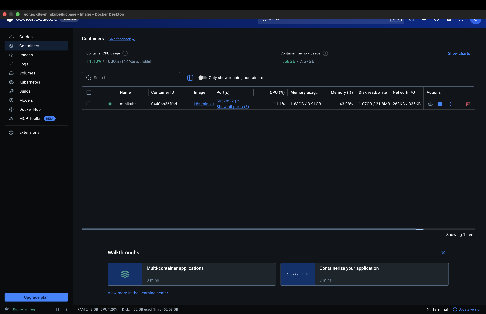

# Exercise: Deploy a Flask app on Minikube using kubectl and yaml

## Objective
Learn Kubernetes basics using Minikube to set up a single-node cluster and deploy Python applications. 
This exercise involves deploying a Flask app using minikube.

## Prerequisites
- The Illustrated **Children’s Guide to Kubernetes**
https://www.cncf.io/phippy/the-childrens-illustrated-guide-to-kubernetes/
- Install Minikube https://minikube.sigs.k8s.io/docs/

## Project Files Setup
### `app.py`
```python
from flask import Flask
app = Flask(__name__)

@app.route('/')
def home():
    return "Hello from Flask on Kubernetes!"

if __name__ == '__main__':
    app.run(host='0.0.0.0', port=15000)
```

### `Dockerfile`
```dockerfile
FROM python:3.8-slim
WORKDIR /app
COPY . /app
RUN pip install flask
CMD ["python", "app.py"]
```

### `flask-deployment.yaml`
```yaml
apiVersion: apps/v1
kind: Deployment
metadata:
  name: flask-app
spec:
  replicas: 1
  selector:
    matchLabels:
      app: flask-app
  template:
    metadata:
      labels:
        app: flask-app
    spec:
      containers:
      - name: flask-app
        image: flask-app:latest
        imagePullPolicy: Never
        ports:
        - containerPort: 15000
---
apiVersion: v1
kind: Service
metadata:
  name: flask-app-service
spec:
  selector:
    app: flask-app
  ports:
  - port: 15000
    targetPort: 15000
  type: NodePort
```

## Step-by-Step Execution & Output

### 1. Build the Docker Image
We configured the terminal to use Minikube's Docker daemon, and then built the image:
```bash
eval $(minikube docker-env)
docker build -t flask-app .
```

### 2. Apply the Deployment and Service
We deployed the Flask app and the NodePort service:
```bash
kubectl apply -f flask-deployment.yaml
```

### 3. Check Deployment Status
```bash
kubectl get deployments
```
**Output:**
```
NAME        READY   UP-TO-DATE   AVAILABLE   AGE
flask-app   1/1     1            1           25m
```

### 4. Verify Pods Created
```bash
kubectl get pods -l app=flask-app
```
**Output:**
```
NAME                         READY   STATUS    RESTARTS      AGE
flask-app-6d58f88547-5kbhn   1/1     Running   1 (11m ago)   25m
```

### 5. Describe the Deployment
```bash
kubectl describe deployment flask-app
```
**Output:**
```
Name:                   flask-app
Namespace:              default
CreationTimestamp:      Wed, 09 Sep 2026 10:47:45 +0530
Labels:                 <none>
Annotations:            deployment.kubernetes.io/revision: 1
Selector:               app=flask-app
Replicas:               1 desired | 1 updated | 1 total | 1 available | 0 unavailable
StrategyType:           RollingUpdate
MinReadySeconds:        0
RollingUpdateStrategy:  25% max unavailable, 25% max surge
Pod Template:
  Labels:  app=flask-app
  Containers:
   flask-app:
    Image:         flask-app:latest
    Port:          15000/TCP
    Host Port:     0/TCP
    Environment:   <none>
    Mounts:        <none>
  Volumes:         <none>
  Node-Selectors:  <none>
  Tolerations:     <none>
Conditions:
  Type           Status  Reason
  ----           ------  ------
  Progressing    True    NewReplicaSetAvailable
  Available      True    MinimumReplicasAvailable
OldReplicaSets:  <none>
NewReplicaSet:   flask-app-6d58f88547 (1/1 replicas created)
Events:
  Type    Reason             Age   From                   Message
  ----    ------             ----  ----                   -------
  Normal  ScalingReplicaSet  25m   deployment-controller  Scaled up replica set flask-app-6d58f88547 from 0 to 1
```

### 6. Check Services
```bash
kubectl get svc
```
**Output:**
```
NAME                TYPE        CLUSTER-IP       EXTERNAL-IP   PORT(S)           AGE
flask-app-service   NodePort    10.110.14.89     <none>        15000:32626/TCP   25m
hello-k8s           NodePort    10.107.242.227   <none>        80:30118/TCP      16d
kubernetes          ClusterIP   10.96.0.1        <none>        443/TCP           16d
```

### 7. Accessing the Application
We used Minikube to access the exposed service:
```bash
minikube service flask-app-service --url
```

## Evidence & Screenshots
Here are the screenshots capturing the successful execution of the deployment and the working browser output.


*Figure 1: Terminal commands execution*


*Figure 2: Flask App running successfully in the browser*

---
**Q&A Summary:**
- **Q:** Why use `imagePullPolicy: Never`?
- **A:** To ensure Kubernetes uses the local image we just built instead of trying to pull it from an external registry.
- **Q:** What is the difference between `port` and `targetPort`?
- **A:** `port` is the exposed Service port on the cluster, while `targetPort` is the port the container is listening on (15000 in this case).
